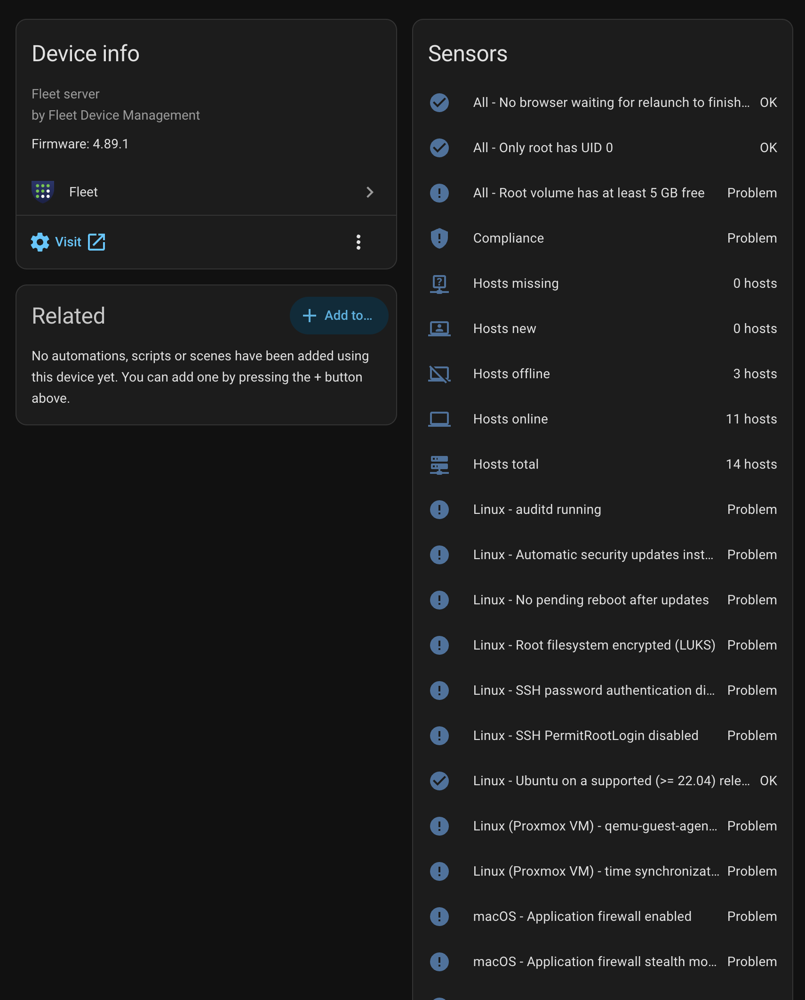
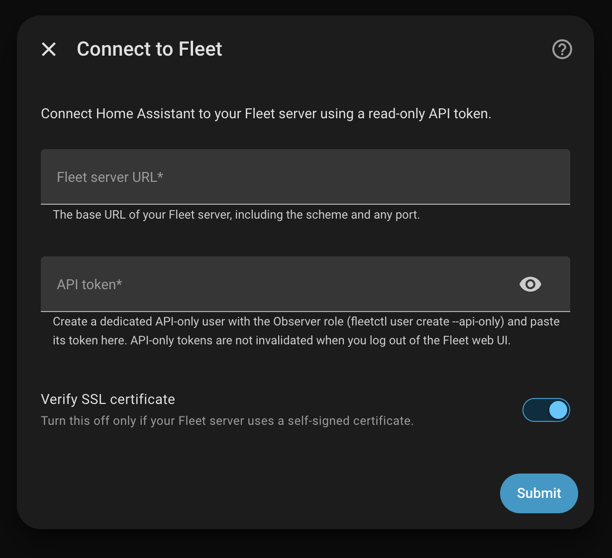

# Fleet for Home Assistant

[](https://github.com/breed007/ha-fleetdm/actions/workflows/pytest.yml)
[](https://github.com/breed007/ha-fleetdm/actions/workflows/validate.yml)
[](https://hacs.xyz)
[](LICENSE)

Bring your endpoint security posture into Home Assistant: which hosts are online,
which policies are failing, and get notified the moment compliance drifts —
instead of at your next manual [Fleet](https://fleetdm.com) review.

This is a HACS-installable custom integration for Fleet, the open-source
osquery-based device management platform. It is read-only by design.

**Requires Home Assistant 2025.2.0 or later.** CI tests against the two most
recent Home Assistant releases plus that floor.

> **Status: Phase 1.** Fleet-level counts, per-policy compliance entities, and
> compliance drift events. Per-host devices and vulnerable-software sensors land
> in Phase 2 — see [Roadmap](#roadmap).

---

## What you get

| Entity | Type | What it tells you |
|---|---|---|
| `sensor.fleet_hosts_online` | sensor | Hosts that have checked in recently |
| `sensor.fleet_hosts_offline` | sensor | Hosts that have not checked in recently |
| `sensor.fleet_hosts_missing` | sensor | Hosts unseen for more than 30 days |
| `sensor.fleet_hosts_new` | sensor | Hosts enrolled in the last 24 hours |
| `sensor.fleet_hosts_total` | sensor | Total enrolled hosts |
| `sensor.fleet_policies_failing` | sensor | How many policies have at least one failing host. Attributes list them, worst first |
| `binary_sensor.fleet_compliance` | binary_sensor (`problem`) | Your headline "is anything wrong" sensor — see [Free vs Premium](#free-vs-premium) |
| `binary_sensor.fleet_<policy_name>` | binary_sensor (`problem`) | One per global policy. `on` = at least one host failing |
| `sensor.fleet_<policy_name>_failing_hosts` | sensor | Failing host count per policy, for graphing. **Disabled by default** |
| `event.fleet_fleet_events` | event | Timeline of compliance transitions |

Every policy entity carries `passing_host_count`, `failing_host_count`,
`critical`, `platform`, `resolution` and `host_count_updated_at` as attributes.

All entities hang off a single **Fleet** hub device whose `configuration_url`
links straight back to your Fleet server.



*A real 14-host fleet: host counts alongside one problem sensor per global
policy, each named after the policy in Fleet.*

---

## Installation

### HACS (recommended)

1. In HACS, open the three-dot menu → **Custom repositories**.
2. Add `https://github.com/breed007/ha-fleetdm` with category **Integration**.
3. Install **Fleet**, then restart Home Assistant.
4. **Settings → Devices & Services → Add Integration → Fleet**.

### Manual

Copy `custom_components/fleetdm/` into your Home Assistant `config/custom_components/`
directory and restart.

---

## Creating an API token (do this first)

Do **not** use your own user account's token. It is tied to your UI session and
carries far more privilege than this integration needs. Create a dedicated
API-only user instead:

```bash
fleetctl user create --name "Home Assistant" --email ha@example.com --api-only --global-role observer
```

`fleetctl` prints an API token. That token is what you paste into the config
flow. API-only user tokens are **not** invalidated when you log out of the Fleet
web UI, which is exactly what you want for an unattended integration.

### Least privilege

| Role | Works? | Notes |
|---|---|---|
| **Observer** | ✅ **Recommended** | Everything in Phase 1 works. This is all the integration needs |
| Observer+ | ✅ | No additional benefit for this integration |
| Maintainer / Admin | ✅ | **Unnecessary.** Do not use — it grants host-modifying and script-execution rights this integration never exercises |

The integration issues `GET` requests only, against four endpoints:
`/version`, `/config`, `/host_summary`, and `/global/policies`. It has no code
path that writes to Fleet, runs queries, or touches hosts.

If your Observer token cannot read `/config` (used only to detect your licence
tier), the integration logs one informational message and continues in Free-tier
mode. It does not fail setup.

### Token rotation

Fleet API-only tokens do not expire on their own. To rotate:

1. Create a new API-only user (or reset the existing one's token with
   `fleetctl user password_reset`).
2. In Home Assistant, **Settings → Devices & Services → Fleet → ⋮ → Reconfigure**,
   or wait for the integration to detect the rejected token and prompt you.
3. Delete the old user in Fleet.

If Fleet ever returns `401`, the integration raises a reauth prompt rather than
silently going stale.

---

## Configuration



| Field | Notes |
|---|---|
| **Fleet server URL** | e.g. `https://fleet.example.com`. Trailing slashes and a missing scheme are normalised, so you cannot accidentally add the same server twice |
| **API token** | The API-only user token from above |
| **Verify SSL certificate** | Leave on unless your Fleet server uses a self-signed certificate |

If Fleet is reachable by both hostname and IP, **use the hostname**. A
certificate issued for the hostname will fail verification when you connect by
IP, and turning verification off to work around that is the wrong fix.

### Options

**Settings → Devices & Services → Fleet → Configure**

| Option | Default | Notes |
|---|---|---|
| Update interval | 60 s | How often to poll. Range 30–3600 s |
| Redact hostnames in diagnostics | on | See [Diagnostics](#diagnostics) |

---

## How fresh is this data, really?

**Important, and easy to get wrong.** Fleet's host status is *check-in
freshness*, not a live ping. A host is "online" if its osquery agent has
reported within the expected interval — it is not a reachability test.

Two separate delays stack up:

1. **osquery check-in interval.** Your agents report on their own schedule,
   commonly 10–60 minutes for policy data.
2. **Fleet's policy count recomputation.** `passing_host_count` and
   `failing_host_count` are recomputed periodically, not per request. Every
   policy entity exposes `host_count_updated_at` so you can see exactly how
   stale the numbers are.

Polling Home Assistant faster than your osquery interval does not make the data
fresher — it just adds load. The 60 second default is about *reacting promptly
to a change Fleet has already computed*, not about sub-minute detection. If your
agents check in every 15 minutes, expect drift notifications up to ~15 minutes
after the fact.

---

## Compliance drift events

This is the feature worth installing for. When a policy crosses between passing
and failing, the integration fires an event — **once per transition**, not once
per poll.

Two surfaces, both fired together:

- **Bus events** — `fleetdm_policy_failing` and `fleetdm_policy_recovered`.
  **Use these for automations.** Each carries a full payload.
- **`event.fleet_fleet_events`** — a UI/history timeline. Because an event
  entity holds one event at a time, prefer the bus events when several policies
  may flip in the same poll.

Bus event payload:

```yaml
entry_id: 01JABCDEF...
policy_id: 2
policy_name: Windows disks encrypted
description: Checks if the hard disk is encrypted on Windows devices
resolution: Turn on BitLocker
platform: windows
critical: true
failing_host_count: 2
passing_host_count: 3
host_count_updated_at: "2025-01-20T15:23:57Z"
```

### Behaviour you can rely on

- **No storm on first setup.** Adding the integration to a fleet that already
  has failing policies fires nothing. The first poll silently establishes a
  baseline; the entity states are correct immediately, only the notifications
  are withheld.
- **No duplicates across restarts.** The baseline is persisted, so restarting
  Home Assistant does not re-notify you about policies that were already failing.
- **No lost transitions.** If a policy starts failing while Home Assistant is
  down, you get the event on the next start.
- **Deleting a failing policy is not a recovery.** It is dropped silently rather
  than firing a misleading "recovered" event.

---

## Example automations

### 1. A critical policy started failing

```yaml
automation:
  - alias: "Fleet: critical policy failing"
    trigger:
      - platform: event
        event_type: fleetdm_policy_failing
    condition:
      # On Fleet Free there is no `critical` flag, so drop this condition.
      - condition: template
        value_template: "{{ trigger.event.data.critical }}"
    action:
      - service: notify.mobile_app_my_phone
        data:
          title: "Fleet: {{ trigger.event.data.policy_name }}"
          message: >-
            {{ trigger.event.data.failing_host_count }} host(s) now failing.
            Fix: {{ trigger.event.data.resolution }}
          data:
            importance: high
      - service: light.turn_on
        target:
          entity_id: light.office_status
        data:
          color_name: red
```

### 2. A host has gone missing

Fleet marks a host `missing` after 30 days unseen. For a faster warning, watch
the offline count instead — a laptop that is dead, lost, or has had its agent
disabled shows up there first.

```yaml
automation:
  - alias: "Fleet: host missing"
    trigger:
      - platform: numeric_state
        entity_id: sensor.fleet_hosts_missing
        above: 0
        for: "01:00:00"
    action:
      - service: notify.mobile_app_my_phone
        data:
          title: "Fleet: host missing"
          message: >-
            {{ states('sensor.fleet_hosts_missing') }} host(s) unseen for 30+ days.
```

### 3. A new device enrolled

Fleet counts a host as `new` for its first 24 hours. Expected during
provisioning — worth a look otherwise.

```yaml
automation:
  - alias: "Fleet: new enrollment"
    trigger:
      - platform: numeric_state
        entity_id: sensor.fleet_hosts_new
        above: 0
    action:
      - service: notify.mobile_app_my_phone
        data:
          title: "Fleet: new host enrolled"
          message: >-
            {{ states('sensor.fleet_hosts_new') }} host(s) enrolled in the last 24h.
```

### Bonus: everything is fine again

```yaml
automation:
  - alias: "Fleet: policy recovered"
    trigger:
      - platform: event
        event_type: fleetdm_policy_recovered
    action:
      - service: notify.mobile_app_my_phone
        data:
          title: "Fleet: recovered"
          message: "{{ trigger.event.data.policy_name }} is passing again."
```

---

## Free vs Premium

The integration detects your licence tier at setup and adapts. **Fleet Free is
fully supported** — no entity errors, no broken sensors.

The one behavioural difference is `binary_sensor.fleet_compliance`:

| Tier | `on` when |
|---|---|
| **Premium** | Any policy flagged **critical** is failing |
| **Free** | Any policy at all is failing |

`critical` is a Fleet Premium field. Rather than reporting permanently healthy on
Free, the sensor falls back to watching every policy. The sensor's `basis`
attribute (`critical_policies` or `all_policies`) tells you which rule is in
effect, and `premium` tells you what was detected.

Per-policy binary sensors behave identically on both tiers.

---

## Diagnostics

**Settings → Devices & Services → Fleet → ⋮ → Download diagnostics**

- **The API token is always redacted**, regardless of settings.
- **Hostnames are redacted by default.** Your Fleet server's URL appears as
  `https://**REDACTED**`. Turn this off in options if you are debugging your own
  setup.
- Policy names and counts are kept even with redaction on — they describe your
  compliance rules, not your machines, and they are what a drift bug report
  actually needs.

---

## Roadmap

**Phase 1 (this release)** — config flow with reauth, fleet-level sensors,
per-policy compliance entities, compliance drift events, diagnostics.

**Phase 2** — per-host devices and entities (with opt-in gating above ~50 hosts),
vulnerable software sensors, `host_enrolled` and `host_went_missing` events from
the activities feed, team/label filtering.

**Phase 3** — optionally running *pre-existing saved queries* from Home
Assistant. Never arbitrary SQL, and it will require a higher-privilege token
with the trade-off spelled out.

---

## Development

```bash
python3 -m venv .venv
.venv/bin/pip install -r requirements-test.txt
.venv/bin/python -m pytest tests/ --cov=custom_components.fleetdm
.venv/bin/ruff check custom_components/ tests/
```

Note that Home Assistant 2026.7 and later require Python 3.14. See
[CONTRIBUTING.md](CONTRIBUTING.md) for the full setup, and
[docs/HACS_SUBMISSION.md](docs/HACS_SUBMISSION.md) for the release process.

CI runs pytest against the two most recent Home Assistant releases and the
supported floor, plus ruff, hassfest and HACS validation.

---

## Contributing

Issues and PRs welcome — see [CONTRIBUTING.md](CONTRIBUTING.md). Contributions
are particularly wanted from anyone running Fleet at a scale where per-host
entities become a question rather than an obvious yes. If you have a 200+ host
fleet, opinions on Phase 2's entity gating would genuinely shape the design.

Please note the [read-only boundary](CONTRIBUTING.md#the-read-only-boundary):
this integration does not modify hosts, and PRs that add host-modifying
behaviour will not be merged.

## Security

The integration issues `GET` requests only and is designed for a least-privilege
Fleet Observer token. To report a vulnerability, see [SECURITY.md](SECURITY.md)
— please do not open a public issue.

## Changelog

See [CHANGELOG.md](CHANGELOG.md).

## License

MIT — see [LICENSE](LICENSE).

Not affiliated with, endorsed by, or sponsored by Fleet Device Management. Fleet
is a trademark of its respective owner; this project uses the name only to
describe what it integrates with.
